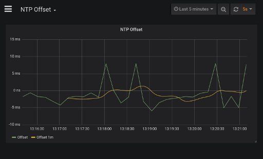

# NTP Offset monitoring with Grafana

Test application for monitoring ntp server offset

## Installation
Create hostlist.txt with list of NTP servers:

    pool.ntp.org
    europe.pool.ntp.org

and run

    docker-compose up

Then open http://127.0.0.1:3000
    
    username:admin
    password: admin

Docker Image contain one dashboard named "NTP Offset"

